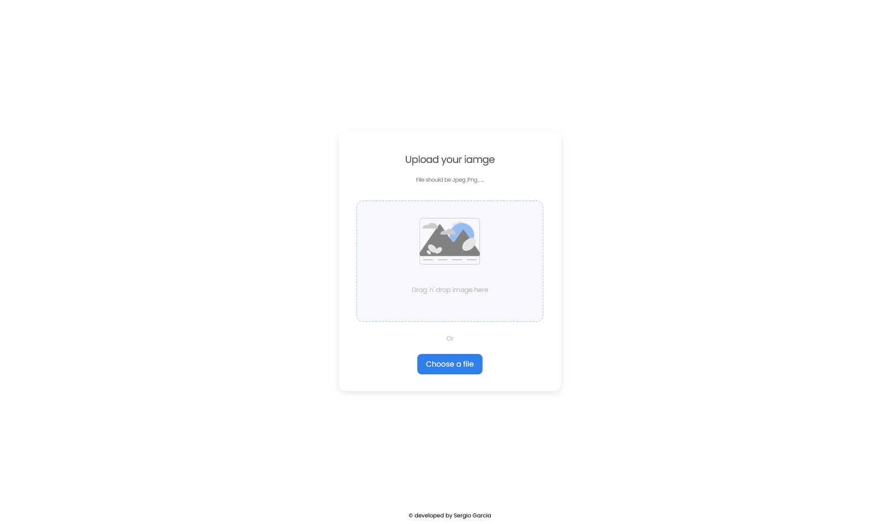

# Image uploader 

Image uploader is a website to upload and visualize image build with react and spring-boot.

##  Description


#### The project structure is a:
- Frontend, developed with react and hosted in GitHub pages.
- Backend, developed with spring-boot and hosted in Heroku app as a container.
- Database, use clearDB add-on in Heroku app with MySQL Engine.


<!-- Please update value in the {}  -->

<h1 align="center">Image Uploader</h1>

<div align="center">
   Solution for a challenge from  <a href="http://devchallenges.io" target="_blank">Devchallenges.io</a>.
</div>

<div align="center">
  <h3>
    <a href="https://sagarciaescobar.github.io/imageUploader/">
      Demo
    </a>
    <span> | </span>
    <a href="https://github.com/sagarciaescobar/imageUploader">
      Solution
    </a>
    <span> | </span>
    <a href="https://devchallenges.io/challenges/rYyhwJAxMfES5jNQ9YsP">
      Challenge
    </a>
  </h3>
</div>

<!-- TABLE OF CONTENTS -->

## Table of Contents

- [Overview](#overview)
  - [Built With](#built-with)
- [Features](#features)
- [How to use](#how-to-use)
- [Contact](#contact)
- [Acknowledgements](#acknowledgements)

<!-- OVERVIEW -->

## Overview



Image uploader is a website to upload and visualize image build with react and spring-boot.

### Built With

<!-- This section should list any major frameworks that you built your project using. Here are a few examples.-->

 

## Features

<!-- List the features of your application or follow the template. Don't share the figma file here :) -->

The project searches to develop a website and API for uploading images and visualizing. The objective was to achieve the user histories proposed by [dev-challenge.io](https://devchallenges.io/challenges/O2iGT9yBd6xZBrOcVirx). The user can drag and drop an image in a container or choose a file and upload it, then the website will show the image from the API.

## How To Use Frontend

<!-- Example: -->

To clone and run this application, you'll need [Git](https://git-scm.com) and [Node.js](https://nodejs.org/en/download/) (which comes with [npm](http://npmjs.com)) installed on your computer. From your command line:

```bash
# Clone this repository
$ git clone https://github.com/sagarciaescobar/imageUploader.git

# Install dependencies
$ cd frontend
$ npm install

# Run the app
$ npm start
```

## Acknowledgements

<!-- This section should list any articles or add-ons/plugins that helps you to complete the project. This is optional but it will help you in the future. For example: -->

- [Steps to replicate a design with only HTML and CSS](https://devchallenges-blogs.web.app/how-to-replicate-design/)
- [Node.js](https://nodejs.org/)
- [Marked - a markdown parser](https://github.com/chjj/marked)

## Contact

- Linkedin [sa-garcia](https://www.linkedin.com/in/sa-garcia/)
- GitHub [@sagarciaescobar](https://github.com/sagarciaescobar)
